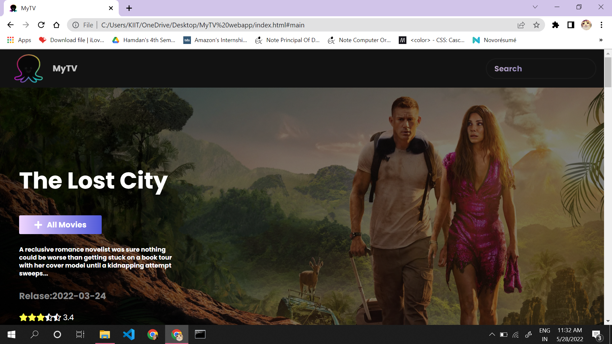
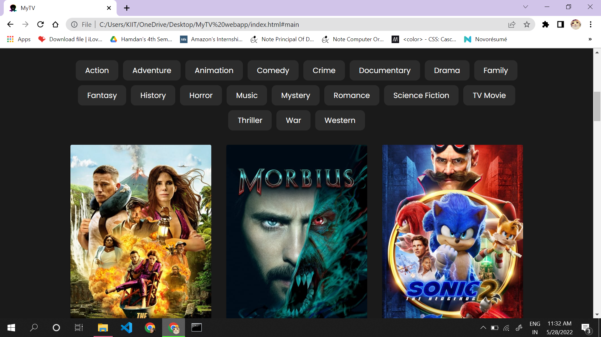

## MICROSOFT-ENGAGE (2022)- Project 

# MyTV !

  

 

# Functionality of the model
* Simple Recommendation system for searching your favorite movies and some more of similar movies.
* All American movies and TV shows are included.
* Theme is kept dynamic.
* User can filter movies on the basis of genre. 
* User can select multiple genres or categories at the same time.
* User can search for movies while entering the name in the search box and hit enter.
* All the movies and shows are provided with title, ratings, duration and overviews.
* Overview to the movies and shows are been provided, user can have a look over it while hovering.
* Clicking on the know more button will redirect you to the trailer page.
* User can navigate from from previous page to next page using JavaScript pagination.
* Fetching of all the data is done by the API used.

 
## 🚀 Technologies Used

* HTML, CSS, Vanilla JavaScript, TMDB API
* VS code
* GitHub

## 📸 Screenshots

## Desktop View

 

## Movie

 

# Running on your local system
* Download the zip file
* Extract it, make sure you have all the files and images in one place.
* Open the "index.html" file on browser.
* It works prefectly.

